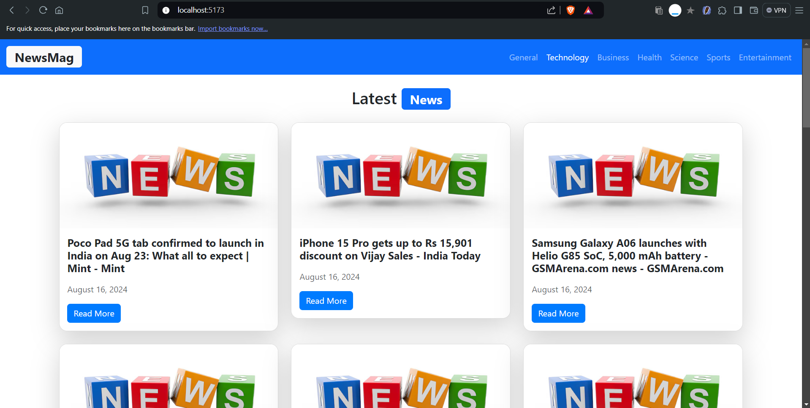
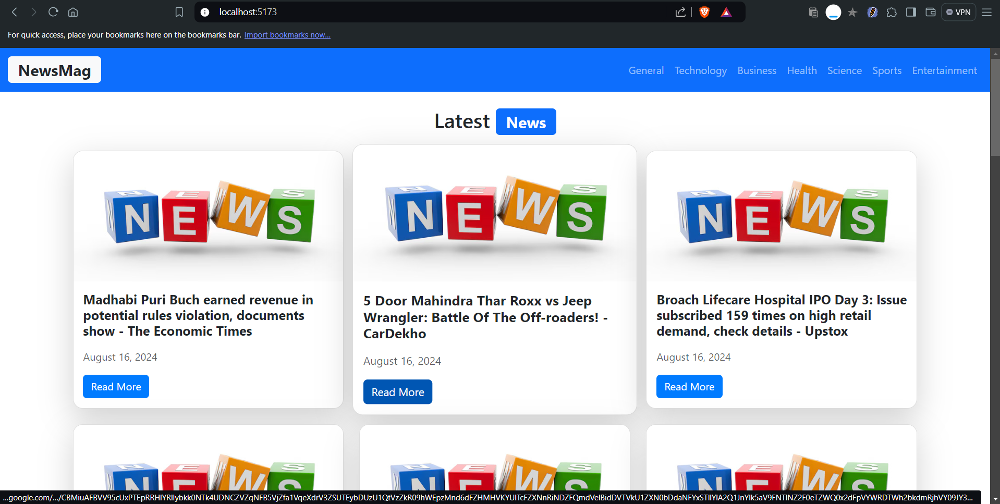
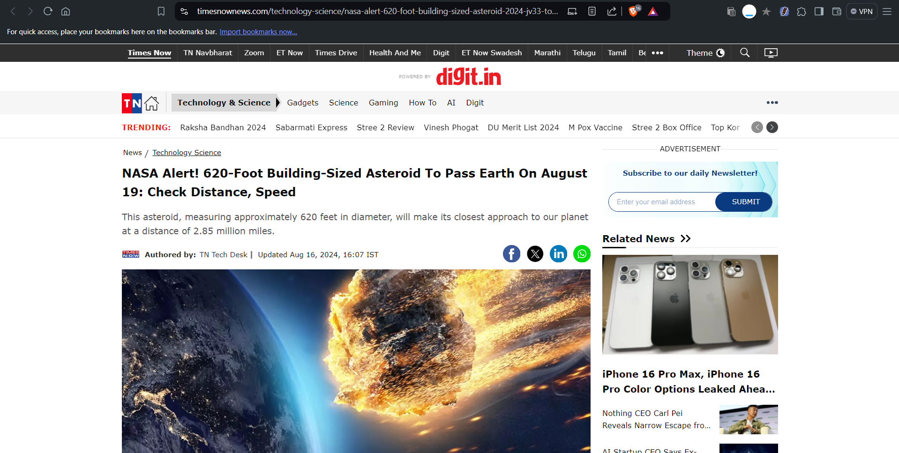

# NewsMag

NewsMag is a modern news application built with React and Bootstrap. It fetches the latest news articles from various categories using the News API and displays them in a visually appealing format. Users can filter news by category and view detailed articles with images and publication dates.

## Table of Contents

- [Features](#features)
- [Screenshots](#screenshots)
- [Installation](#installation)
- [Usage](#usage)
- [Common Issues](#common-issues)
- [License](#license)

## Features

- Fetches news articles from the News API.
- Categorizes news into various types (e.g., Technology, Business, Health, etc.).
- Displays news headlines, initial lines of the description, and publication dates.
- Provides hover effects for an interactive user experience.
- Responsive design with Bootstrap.

## Screenshots

### Home Page


### Checking Full Article Page


### News Detail Page


## Installation

To run this project locally, follow these steps:

1. **Clone the repository:**
   
3. **Install dependencies:**

    Ensure you have Node.js and npm installed. Install the project dependencies using npm:

    ```bash
    npm install
    ```

4. **Create a `.env` file:**

    Create a `.env` file in the root directory of the project and add your News API key:

    ```env
    VITE_API_KEY=your-news-api-key
    ```

5. **Run the development server:**

    Start the development server with:

    ```bash
    npm start
    ```

    The app will be available at `http://localhost:5173`.

## Usage

1. **Navigate to the app in your browser.**

2. **Use the navbar to select different news categories.** The news feed will update accordingly.

3. **Hover over the news cards** to see the interactive effect and view details of each article.

## Common Issues

1. **No news images displayed:**

   - Ensure that the `src` attribute in the `img` tag of `NewsItem` is correctly fetching from the `urlToImage` field of the API response.
   - Verify that your API response includes image URLs.

2. **Categories not loading:**

   - Check that the `setCategory` function is properly updating the `category` state in the `App` component.
   - Ensure that the category values match the ones expected by the News API.

3. **No description available:**

   - Confirm that the `description` field is present in the API response. The application will now show the initial lines of news instead of placeholder text when descriptions are missing.

## License

This project is licensed under the MIT License. See the [LICENSE](./LICENSE) file for details.
